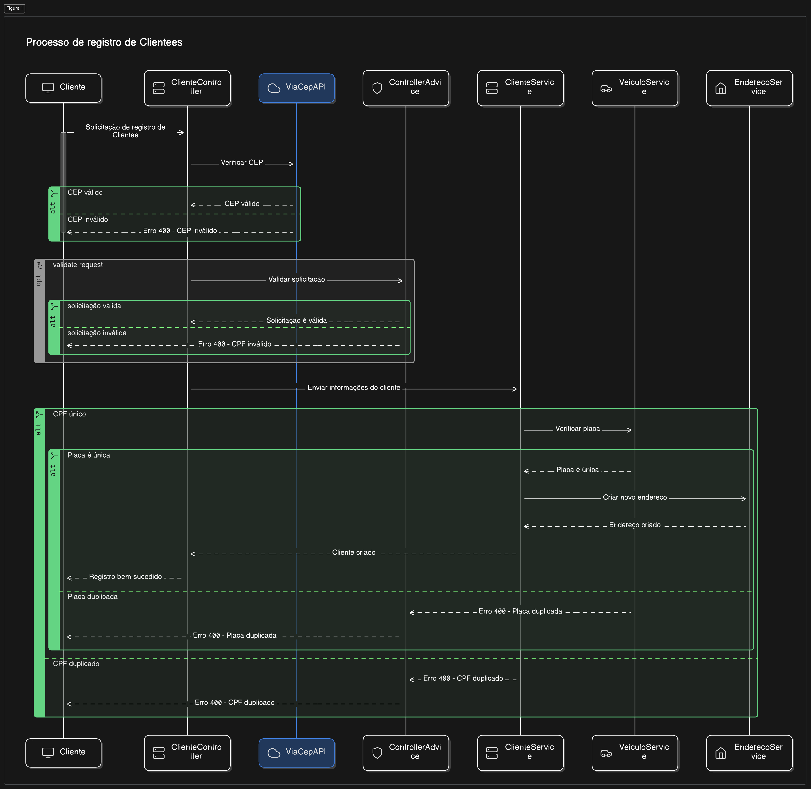
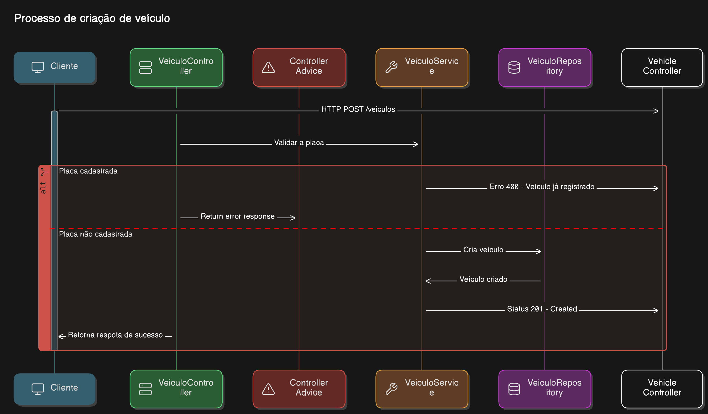
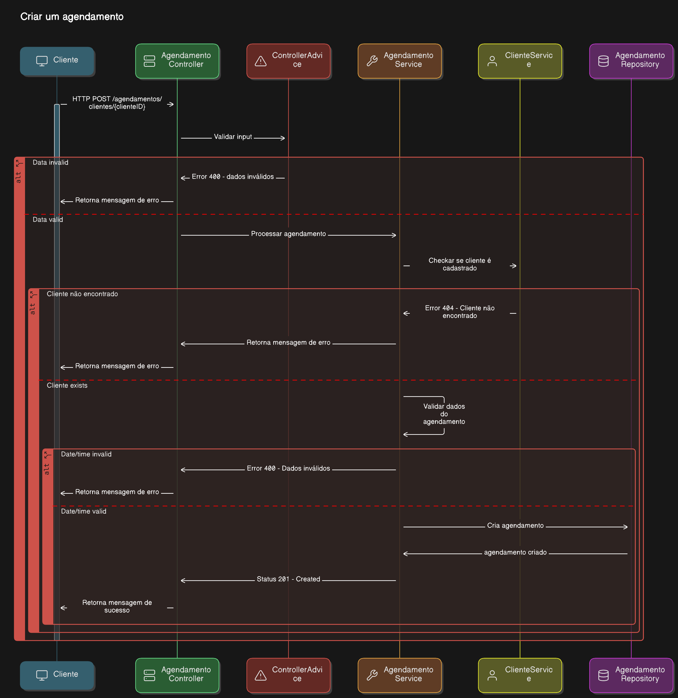
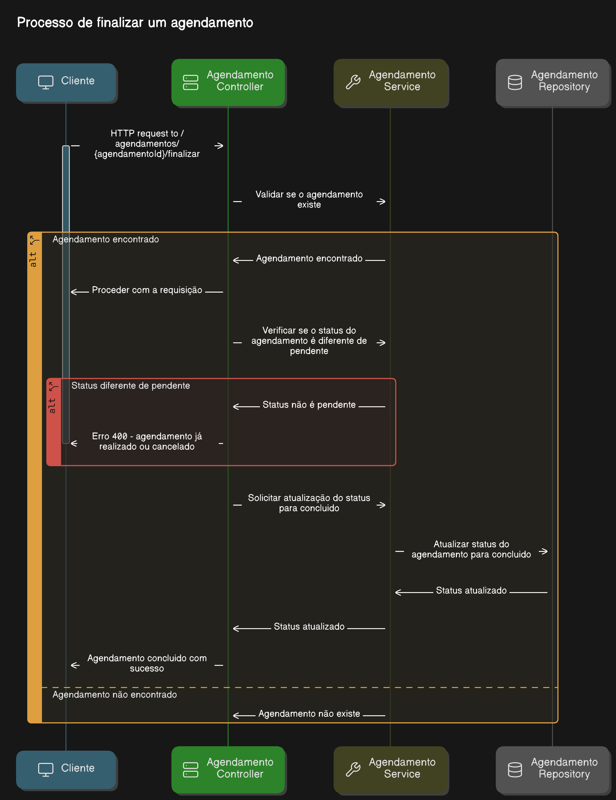

<h1 align="center">
  Ultracar
</h1>

<p align="center">
  
  
  
</p>

# Ultracar - Manutenção de veículos

Boas-vindas ao repositório Ultracar !

Este repositório é destinado ao projeto Manutenção de veículos. Foi desenvolvido um sistema para
gerenciar a manutenção de veículos de uma oficina mecânica. O sistema permite o cadastro de
veículos, clientes e agendamento de serviços. Além disso, é possível gerenciar os agendamentos,
finalizar
serviços ou cancelar agendamentos.

## ⚙ Instalação

### 📝 Requisitos

Antes de baixar o projeto é necessário ter as seguintes ferramentas já instaladas:

* [Git](https://git-scm.com)
* [Java 17](https://www.oracle.com/java/technologies/javase/jdk17-archive-downloads.html)
* [Maven](https://maven.apache.org/)
* [Docker](https://www.docker.com)
* [Docker Compose](https://docs.docker.com/compose/install/)
* [PostgreSQL](https://www.postgresql.org/download/) (Opcional)
* [Insomnia](https://insomnia.rest/) (Opcional)

### Configuração

Passo a passo para clonar e executar a aplicação na sua máquina:

1. Clone o repositório (Utilizar Link SSH).
2. Acesse a pasta do projeto:
    ```bash
    cd auto-maintenance-manager
    ```

3. Execute os containers do banco de dados e da aplicação:
    ```bash
    docker compose up -d --build
    ```

> Nota: O comando acima irá criar os containers do banco de dados e da aplicação. O container da
> aplicação irá expor a porta 8080, que é a porta padrão do Spring Boot. O container do banco de
> dados irá expor a porta 5432, que é a porta padrão do PostgreSQL. Dependendo da versão do docker
> compose o comando será 'docker-compose'.

4. Realizar as requisições.

#### Localmente

1. Clone o repositório (Utilizar Link SSH).
2. Acesse a pasta do projeto:
    ```bash
    cd auto-maintenance-manager
    ```
3. Instalação e compilação dos recursos necessários
    ```bash
    mvn install -DskipTests
    ```
4. Reempacotamento do projeto
    ```bash
    mvn clean package
    ```
5. Execução do projeto
    ```bash
    java -jar target/auto-maintenance-manager-0.0.1-SNAPSHOT.jar
    ```

> Nota: o servidor tentará conectar-se com o banco de dados através da porta 5432.

### Documentação

Após o executar o servidor back-end, é possível acessar a documentação da api, através da rota
`/swagger-ui/index.html` na aplicação. Caso tenha utilizado a porta padrão, `8080`, o endereço será:
[http://localhost:8080/swagger-ui/index.html](http://localhost:8080/swagger-ui/index.html)

#### Realização de Requisições

Este arquivo contém uma coleção de endpoints para a plataforma Insomnia, que podem ser importados
diretamente para a aplicação, simplificando o processo de teste e interação com a API.

- [Insomnia_Ultracar.json](./Insomnia_Ultracar.json)

<details>
    <summary><strong>Endpoints da Aplicação</strong></summary>

### Clientes

#### Cadastro de clientes

- Método: POST
- URL: /persons
- Descrição: Cria novo usuário
- Corpo:
    ```json
    {
        "nome": "string",
        "cpf": "string",
        "cep": "string",
        "placa": "string",
        "modelo": "string",
        "marca": "string",
        "ano": 0
    }
    ```

#### Listar clientes

- Método: GET
- URL: /clientes
- Descrição: Retorna todos os clientes cadastrados

#### Buscar cliente por ID

- Método: GET
- URL: /clientes/{clienteId}
- Descrição: Retorna informações de um cliente específico
- Parâmetros:
    - clienteId: ID do cliente

#### Adicionar veículo a um cliente

- Método: PATCH
- URL: /clientes/{clienteId}/veiculos
- Descrição: Adiciona veículo a um cliente
- Corpo:
    ```json
    {
        "placa": "string"
    }
    ```

### Veículos

#### Cadastro de veículos

- Método: POST
- URL: /veiculos
- Descrição: Cria novo veículo
- Corpo:
    ```json
    {
        "placa": "string",
        "modelo": "string",
        "marca": "string",
        "ano": 0
    }
    ```

#### Listar veículos

- Método: GET
- URL: /veiculos
- Descrição: Retorna todos os veículos cadastrados

#### Buscar veículo por ID

- Método: GET
- URL: /veiculos/{veiculoId}
- Descrição: Retorna informações de um veículo específico
- Parâmetros:
    - veiculoId: ID do veículo

### Agendamentos

#### Cadastro de agendamento

- Método: POST
- URL: /agendamentos/clientes/{clienteId}
- Descrição: Cria novo agendamento
- Corpo:
    ```json
    {
        "dataAgendamento": "LocalDateTime",
        "descricaoServico": "string"
    }
    ```

#### Listar agendamentos

- Método: GET
- URL: /agendamentos
- Descrição: Retorna todos os agendamentos cadastrados

#### Buscar agendamento por ID

- Método: GET
- URL: /agendamentos/{agendamentoId}
- Descrição: Retorna informações de um agendamento específico
- Parâmetros:
    - agendamentoId: ID do agendamento

#### Listar agendamento por intervalo de datas

- Método: GET
- URL: /agendamentos/clientes/{clienteId}
- Descrição: Retorna todos os agendamentos de um cliente específico em um intervalo de datas
- Parâmetros:
    - clienteId: ID do cliente
- Corpo:
    ```json
    {
        "dataInicio": "LocalDateTime",
        "dataFim": "LocalDateTime"
    }
    ```

#### Concluir agendamento

- Método: PATCH
- URL: /agendamentos/{agendamentoId}/finalizar
- Descrição: Finaliza um agendamento
- Parâmetros:
    - agendamentoId: ID do agendamento

#### Cancelar agendamento

- Método: PATCH
- URL: /agendamentos/{agendamentoId}/cancelar
- Descrição: Cancela um agendamento
- Parâmetros:
    - agendamentoId: ID do agendamento

</details> 

### Funcionalidades

<details>
    <summary><strong>Diagramas de sequência</strong></summary>

- Cadastro de clientes
    - Nome
    - CPF
    - CEP
    - Placa do veículo
    - Modelo do veículo
    - Marca do veículo
    - Ano do veículo
      

- Cadastro de veículos
    - Placa
    - Modelo
    - Marca
    - Ano
      

- Agendamento de serviços
    - Data do agendamento
    - Descrição do serviço
    - Cliente
      

- Gerenciamento de agendamentos
    - Agendamentos pendentes
      
      

</details> 

## Contato

- E-mail: [yagomoreira@gmail.com](mailto:yagomoreira@gmail.com)
- LinkedIn: [Yago Moreira](https://www.linkedin.com/in/yagobmoreira/)
